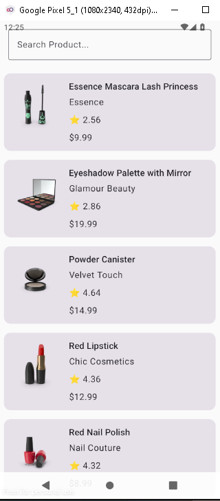
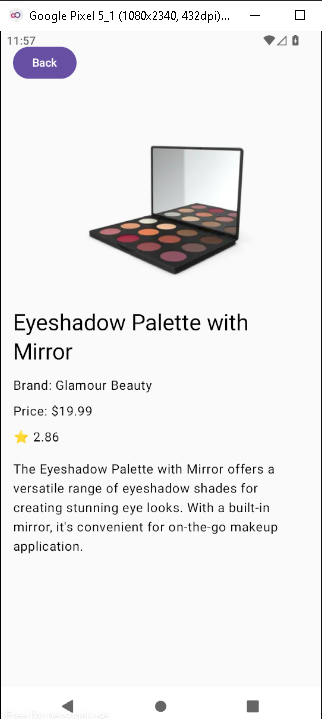
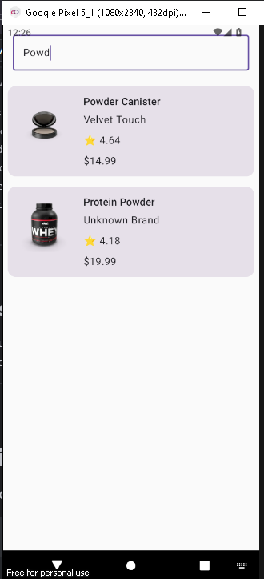

# Product Browser App (Kotlin Multiplatform)

A Kotlin Multiplatform Mobile (KMM) application built using Compose Multiplatform that displays products from the DummyJSON API. The application follows Clean Architecture and supports both Android and iOS.

---

## Business Requirements

The application allows users to:

- View a list of products
- View product details
- Search products using the API
- Display product images
- Navigate between Product List and Product Detail screens

---

## Tech Stack

- Kotlin Multiplatform (KMP)
- Compose Multiplatform
- Ktor Client
- kotlinx.serialization
- StateFlow
- Clean Architecture
- Coil 3 (Image Loading)
- Kotlin Test

---

## Architecture

The project follows Clean Architecture.

```
Presentation
│
├── Screens
├── ViewModels
├── UI State
└── Events

↓

Domain

├── Models
├── Repository Interfaces
└── Use Cases

↓

Data

├── Remote API
├── DTOs
├── Repository Implementation
└── Mappers
```

The architecture separates UI, business logic, and data access, making the application easier to maintain and test.

---

## Project Structure

```
shared
│
├── core
│   └── network
│
├── data
│   ├── remote
│   ├── dto
│   ├── mapper
│   └── repository
│
├── domain
│   ├── model
│   ├── repository
│   └── usecase
│
├── presentation
│   ├── components
│   ├── navigation
│   ├── productlist
│   └── productdetail
│
└── di
```

---

## Features

- Product Listing
- Product Detail Screen
- Product Search
- Product Images
- Loading Indicator
- Error Handling
- Navigation
- Unit Test

---

## API

DummyJSON Products API

https://dummyjson.com/products

Search Endpoint

https://dummyjson.com/products/search?q=phone

---

## Build & Run

### Android

1. Open the project in Android Studio.
2. Sync Gradle.
3. Run the `androidApp` configuration.

### iOS

1. Open the generated Xcode project.
2. Select an iOS Simulator.
3. Build and Run.

---

## Unit Testing

The project includes a unit test for:

- GetProductsUseCase

using a Fake Repository implementation.

---

## Trade-offs

- Manual Dependency Injection is used instead of Koin/Hilt to keep the project lightweight.
- Remote API only (no local caching).
- Navigation implemented using Compose Multiplatform Navigation.
- UI focuses on functionality rather than advanced animations.

---

## Future Improvements

- Category Filtering
- Pagination
- Offline Caching
- Favorites
- Pull-to-Refresh
- Better Error Screens
- Dark Theme
- Dependency Injection using Koin
- UI Tests

---

## Screenshots

### Product List



### Product Detail



### Search



---

## Author

Himanshu
